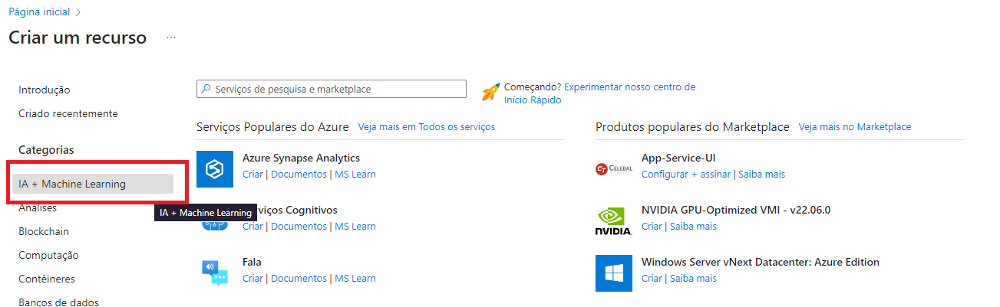

# Desafio: Reconhecimento Facil e transformação de imagens em Dados no Azure ML

Iniciaremos acessando o [portal do Azure](https://www.portal.azure.com).

- Criaremos um Recurso (+Create a resource).

 Opção no Menu (Três traços Verticais) ao lado esquerdo que poderá não estar visível.

- Clique para que ele expanda:

- Ou ainda na parte inferior da página você encontrará um Menu com a opção "+ Create a resource"

- Busque em Categorias "AI + Aprendizado de Máquina (Machine Learning) ou procure pela lupa.

- Clique para abrir as opções. Selecione "Criar" em Seriços de IA do Azure (Azure AI Service)

- Preencha os dados do seu Projeto

- Preencha Nível de Preços : SO.

- Marque a Caixa li e compreendi todos os termos abaixo.
Clique em "Revise + crie (Review +create)

- Aguarde a finalização e clique em "Create (Criar)"

- Serviço criado com sucesso

## A segunda etapa será conectar o Serviço que acabamos de criar ao Vision Studio

Acesse o [Vision Studio](https://portal.vision.cognitive.azure.com/?azure-portal=true) .

- Clique em "Ver todos os recursos (View all resources)

- Selecione o seu recurso criado e clique em "Selecione como recurso padrão (Select as default resource)"

- Após, clique no "x" no canto superior direito para sair.

## A terceira etapa é testar a funcionalidade do Vision Studio

### Detectar Rostos no Vision Studio

- Clicar na aba face.
- Clicar em detectar rostos em uma imagem.

- Marque a caixa "Experimente".
- Você pode Inserir uma foto, Tirar uma foto ou utilizar uma das fotos ao lado.

* Teste

Este serviço já vem com algumas amostras de imagens. Porém, submeti uma nova foto:

* Resultado

Como observado, a informação de detecção de dois rostos foi efetuada.

## Reconhecimento Óptico de Caracteres

Um serviço em que consiste extrair textos nos mais diversos contextos como em fotos, documentos, notas fiscais. Sendo um serviço interessante para utilização em projetos para scanear documentos no geral, otimizando espaço físico e gerando maior agilidade na localização destes arquivos.

- Clicar na aba Reconhecimento Óptico de Caracteres.
- Clicar em Extraia texto de imagens.
- Marque a caixa "Experimente".
- Você pode Inserir uma foto, Tirar uma foto ou utilizar uma das fotos ao lado.

## Teste

Para testar este serviço, submeti uma imagem que eu tinha como arquivo, contendo vários textos com fontes, cores, tamanhos e formatos diferente:

## Adicione Legendas às imagens

- Clicar na análise de imagem.
- Clicar em adicione legendas às imagens.

# Teste

Nesta foto, o serviço detecta a estátua de uma mulher segurando uma balnça no topo de um "prédio".

# Considerações Finais

A capacidade do Azure Vision Studio de adicionar legendas e extrair marcas de imagens amplia horizontes na análise de conteúdo visual, possibilitando melhorias significativas em acessibilidade, análise de marca e muito mais. Esses serviços oferecem uma variedade de formas inclusivas que podem ser integradas em projetos para facilitar a vida de todos, sempre respeitando as normas éticas no uso dos dados e da IA.

